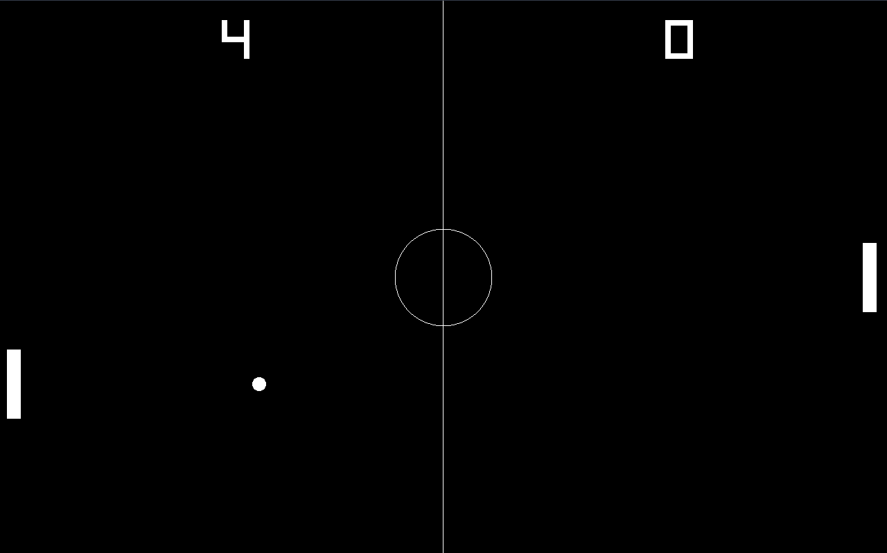

# Pong

A classic Pong game built with **C++** and **raylib**. Play against the CPU in a timeless arcade matchup.



## Features

- Player vs CPU gameplay
- Keyboard controls (Arrow Up / Arrow Down)
- Score tracking for both sides
- Ball speed randomization on reset

## Build

### Prerequisites

- [raylib](https://www.raylib.com/) installed on your system

### Compile

```bash
cmake -B build
cmake --build build
```

### Run

```bash
./build/Pong
```

## Controls

| Key          | Action       |
|--------------|--------------|
| Arrow Up     | Move paddle up   |
| Arrow Down   | Move paddle down |
